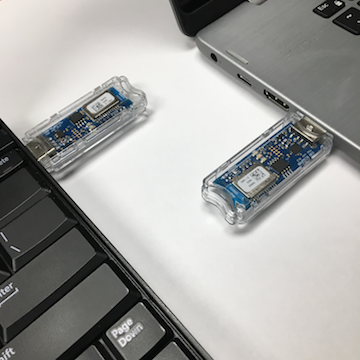

# Conectric Internet of Things Network Protocol

## Introduction
We are pleased to announce the launch of our Internet of Things Network Protocol stack. It is based on [Contiki](http://www.contiki-os.org/), the ubiquitous open source operating system for the Internet of Things. It connects tiny low-cost, low-power microcontrollers to the Internet and is a powerful toolbox for building complex wireless systems.

We have worked hard to develop an easy-to-use mesh networking stack accompanied with concise documentation for you to get started quickly. We have promised to deliver an end-to-end wireless device messaging that requires painless network configuration and a little to no knowledge of mesh networking.

## Minimum Hardware Requirements
In order to receive messages from sensors over the Conectric network, you need to have at least one Conectric USB Router and one of the Conectric Sensors (Temperature, Humidity, Motion, Switch, RS485 Hub, etc). We have published [an article on Medium](https://medium.com/conectric-networks/announcing-conectrics-usb-iot-gateway-sensor-product-86087af7ae57) that shows you how to go from unboxing to a functional mesh network in a matter of minutes. You can also send multihop text messages from one computer to another connected through a Conectric USB Router on each end. Please leave us an email at [solutions@conectric.com](mailto:solutions@conectric.com) for questions about our low-cost IoT Sensors and Device Solutions.

## Wireless Multihop Messaging
The easiest way of testing wireless messaging is by setting up two computers with two Conectric USB Routers. Over a distance of hundreds of feet, wireless messaging stops working because it is simply out of network coverage. The solution to this problem is very straightforward. Just by putting some Conectric USB Routers inbetween those computers, you can seamlessly enable multihop messages over our mesh network. But first things first: you need to understand how to send/receive messages over the serial communication port on the Conectric USB Router.

## Serial Communication Protocol
Conectric USB Routers have a built-in serial communication port through which we send/receive messages. An outgoing wireless messaging starts with `<` and an incoming one starts with `>`. Messages are sent in hexadecimal string format and every two hexadecimal digits represent one byte. Let's pretend that we want to send `HELLO` (= `48 45 4c 4c 4f` as a hexadecimal string) from one end to the other. The outgoing wireless messaging protocol is as follows.

### Outgoing Message Protocol

`<` `LEN` `REQ` `DESTH` `DESTL` `01` `DATA0` `DATA1` ... `DATAn`

* `<` an outgoing message starts with this character
* `LEN = 0x0a` message length including this length byte itself is 10 bytes
* `REQ = 0x61` request/message type of `CONECTRIC_TEXT_MESSAGE`
* `DESTH = 0xdf` destination address high byte (of 16-bit short address `0xdfbc`)
* `DESTL = 0xbc` destination address low byte (of  16-bit short address `0xdfbc`)
* `01 = 0x01` this byte is reserved, always 0x01
* `DATA0 = 0x48` letter `H`
* `DATA1 = 0x45` letter `E`
* `DATA2 = 0x4c` letter `L`
* `DATA3 = 0x4c` letter `L`
* `DATA4 = 0x4f` letter `O`

So sending out a text message `HELLO` would look like this:

    <0a6100000148454c4c4f

You can use any serial terminal and type those hexadecimal digits manually by hand over the serial terminal, then press the `RETURN` key to send them out over the air. If the wireless device having 16-bit short address of `0xdfbc` is listening on the other end, and it is within network coverage, it will receive a message that looks like the following:

    >060101001e2008612048454c4c4f

### Incoming Message Protocol

`>` `HDRLEN` `SEQ` `HOPS` `HOPMAX` `SRCH` `SRCL` `DLEN` `DATA0` `DATA1` ... `DATAn`

* `>` an incoming message starts with this character
* `HDRLEN = 0x06` header length including this length byte itself is 6 bytes
* `SEQ = 0x01` message sequence number
* `HOP = 0x01` message has been passed through 1 hop (direct message)
* `HOPMAX = 0x00` zero value means that no hop limit being implemented
* `SRCH = 0x1e` destination address high byte (of 16-bit short address `0x1e20`)
* `SRCL = 0x20` destination address low byte (of  16-bit short address `0x1e20`)
* `DLEN = 0x08` data length is 8 bytes long, including the length byte itself
* `DATA0 = 0x61` message type of `CONECTRIC_TEXT_MESSAGE`
* `DATA1 = 0x20` power level at 3.2V
* `DATA2 = 0x48` letter `H`
* `DATA3 = 0x45` letter `E`
* `DATA4 = 0x4c` letter `L`
* `DATA5 = 0x4c` letter `L`
* `DATA6 = 0x4f` letter `O`

## Message Exchange Patterns and Types
Conectric Network uses two very basic methods to communicate: Request-Response and One-Way. There may be a series of message exchanges from both ends until the complete message is collected. Each message exchange contains a message type. Each message type can be categorized into Request, Configuration, Reply, or just plain Message, depending on how it was sent over the network.

An outgoing message with destination address to `0xFFFF` is a local broadcast request to neighbors only. If the destination address is set to `0x0000`, the message is broadcasted to all listening devices, network-wide. The outgoing message will only be sent as point-to-point request if provided with the 16-bit short address.

### Supported Request Type
| Request Types                              | Enumeration |
|:-------------------------------------------|:-----------:|
| CONECTRIC\_RS485\_POOL                     |     0x36    |
| CONECTRIC\_RS485\_POOL\_CHUNK              |     0x38    |
| CONECTRIC\_TEXT\_MESSAGE                   |     0x61    |

### Supported Reply Type
| Reply Types                                | Enumeration |
|:-------------------------------------------|:-----------:|
| CONECTRIC\_RS485\_POOL\_REPLY              |     0x37    |
| CONECTRIC\_RS485\_POOL\_CHUNK\_REPLY       |     0x39    |
| CONECTRIC\_RS485\_POOL\_REPLY\_IN\_CHUNK   |     0x42    |

### Supported Config Type
| Config Types                               | Enumeration |
|:-------------------------------------------|:-----------:|
| CONECTRIC\_RS485\_CONFIG                   |     0x70    |

### Supported Message Type
| Message Types                              | Enumeration |
|:-------------------------------------------|:-----------:|
| CONECTRIC\_SENSOR\_BROADCAST_RHT           |     0x30    |
| CONECTRIC\_SENSOR\_BROADCAST_SW            |     0x31    |
| CONECTRIC\_SENSOR\_BROADCAST_OC            |     0x32    |
| CONECTRIC\_SUPERVISORY\_REPORT             |     0x33    |
| CONECTRIC\_SENSOR\_BROADCAST\_PLS          |     0x40    |
| CONECTRIC\_SENSOR\_BROADCAST\_USB          |     0x41    |
| CONECTRIC\_DEVICE\_BROADCAST\_BOOT\_STATUS |     0x60    |
| CONECTRIC\_TEXT\_MESSAGE                   |     0x61    |

## Outgoing Message Field
### Request Type, Destination, and Data Fields
`LEN` `REQ` `DESTH` `DESTL` `01` `DATA0` `DATA1` ... `DATAn`

Outgoing messages contain request/message type, destination address and data fields. The `LEN` field is the total length of outgoing message, in bytes, including the length field itself.

### RS485 Request Field (RS485)
`LEN` `REQ` `DESTH` `DESTL` `01` `DATA0` `DATA1` ... `DATAn`

* `LEN`, total bytes from `LEN` to `DATAn`
* `REQ`, valid value of [Supported Request Type](#supported-request-type) with `CONECTRIC_RS485` prefix
* `DESTH`, broadcast, netbroadcast, or point-to-point address
* `DESTL` broadcast, netbroadcast, or point-to-point address
* `01`, reserved byte, always 0x01
* `DATA0` `DATA1` ... `DATAn`, the RS485 request

### RS485 Config Field (RS485)
`LEN` `CONF` `DESTH` `DESTL` `01` `DATA0` `DATA1` ... `DATAn`

* `LEN`, total bytes from `LEN` to `DATAn`
* `CONF`, the only valid value is 0x70, `CONECTRIC_RS485_CONFIG` configuration type
* `DESTH`, broadcast, netbroadcast, or point-to-point address
* `DESTL` broadcast, netbroadcast, or point-to-point address
* `01`, reserved byte, always 0x01
* `DATA0`, baudrate: 0=2400, 1=4800, 2=9600, 3=19200
* `DATA1`, parity: 0=none, 1=odd, 2=even
* `DATA2`, stop bits: 0=1-bit or 1=2-bit
* `DATA3`, bit-mask: 0xFF=8-bit, 0x7F=7-bit, etc.

### Text Message Request Field
`LEN` `REQ` `DESTH` `DESTL` `01` `DATA0` `DATA1` ... `DATAn`

* `LEN`, total bytes from `LEN` to `DATAn`
* `REQ`, valid value is 0x61, `CONECTRIC_TEXT_MESSAGE` request type
* `DESTH`, broadcast, netbroadcast, or point-to-point address
* `DESTL` broadcast, netbroadcast, or point-to-point address
* `01`, reserved byte, always 0x01
* `DATA0` `DATA1` ... `DATAn`, the text message

## Incoming Message Fields
### Message Header and Data Fields
`HDRLEN` `SEQ` `HOPS` `HOPMAX` `SRCH` `SRCL` `DLEN` `DATA0` `DATA1` ... `DATAn`

Incoming messages contain message header and data fields. In the message header you can find message sequence number, number of hops, and the originator short address. In the data field, we use the first three bytes to indicate the data length, message type, and power level. The rest of the data field is anything else that was originally sent by the originator.

### Message Header
`HDRLEN` `SEQ` `HOPS` `HOPMAX` `SRCH` `SRCL`

* `HDRLEN`, total bytes from `HDRLEN` to `SRCL`
* `SEQ`, unique number for every message sent out
* `HOPS`, number of hops the message has been passed through
* `HOPMAX`, hop limit before the message is dropped, unlimited hops if this value is zero
* `SRCH`, originator address high byte
* `SRCL`, originator address low byte

### Temperature/Humidity Sensor Data Field (RHT)
`DLEN` `DATA0` `DATA1` ... `DATAn`

* `DLEN`, total bytes from `DLEN` to `DATAn`
* `DATA0`, valid value is 0x30, `CONECTRIC_SENSOR_BROADCAST_RHT` message type
* `DATA1`, valid value are 0 - 32 represent power level from 0V - 3.2V
* `DATA2`, temperature high byte
* `DATA3`, temperature low byte
* `DATA4`, humidity high byte
* `DATA5`, humidity low byte

### Switch Sensor Data Field (SW)
`DLEN` `DATA0` `DATA1` ... `DATAn`

* `DLEN`, total bytes from `DLEN` to `DATAn`
* `DATA0`, valid value is 0x31, `CONECTRIC_SENSOR_BROADCAST_SW` message type
* `DATA1`, valid value are 0 - 32 represent power level from 0V - 3.2V
* `DATA2`, valid value are 0x71 (switch is closed); 0x72 (switch is open)

### Motion Detection Data Field (OC)
`DLEN` `DATA0` `DATA1` ... `DATAn`

* `DLEN`, total bytes from `DLEN` to `DATAn`
* `DATA0`, valid value is 0x32, `CONECTRIC_SENSOR_BROADCAST_OC` message type
* `DATA1`, valid value are 0 - 32 represents power level from 0V - 3.2V
* `DATA2`, valid value are 0x81 (motion detected)

### RS485 Data Field (RS485)
`DLEN` `DATA0` `DATA1` ... `DATAn`

* `DLEN`, total bytes from `DLEN` to `DATAn`
* `DATA0`, valid value is 0x37, `CONECTRIC_RS485_POLL_REPLY` message type
* `DATA1`, valid value are 0 - 32 represents power level from 0V - 3.2V
* `DATA2 ... DATAn`, the RS485 response

### RS485 Data Field Longer Than 64 bytes (RS485)
`DLEN` `DATA0` `DATA1` ... `DATAn`

* `DLEN`, total bytes from `DLEN` to `DATAn`
* `DATA0`, valid value is 0x37, `CONECTRIC_RS485_POLL_REPLY` message type
* `DATA1`, valid value are 0 - 32 represents power level from 0V - 3.2V
* `DATA2 ... DATAn`, the RS485 response

### Text Message Data Field
`DLEN` `DATA0` `DATA1` ... `DATAn`

* `DLEN`, total bytes from `DLEN` to `DATAn`
* `DATA0`, valid value is 0x61, `CONECTRIC_TEXT_MESSAGE` message type
* `DATA1`, valid value are 0 - 32 represents power level from 0V - 3.2V
* `DATA2 ... DATAn`, the text message

## Executable Serial Command
Other than incoming and outgoing messages any input from serial terminal that does not start with `<` or `>` is considered as an executable serial command to change device configuration. The following subsections describe some of those executable serial commands.

### MAC Address Read (`MR` - MAC Read)
This command reads the full 64-bit MAC Address. The 16-bit short address are extracted from the last two bytes. In this example, it is `0xdfbc`. Example:

    MR
    MR:00124b000514dfbc

### Configure USB Router as a data sink (`SS` - Sink Set)
When the USB Router is set as a data sink, it becomes the gateway between the mesh network and the outside world. The mesh network can have single or multiple data sinks. All of the sensor broadcasts will be sent to a sink with the lowest cost. Example of use:

    SS
    SS:Ok

### Disable USB Router as a data sink (`SR` - Sink Reset)
By default, the USB Router is not a data sink. But if it was configured as one, then this command will turn if off.

    SR
    SR:Ok

### Show data sinks table (`ST` - Sink Table)
By default, the USB Router keeps a table of data sink broadcasts. If no data sink is seen, the command returns no table.

    ST
    ST:0:df.bc(C:2:LT:10)
    |  |  |  |   |    |
    |  |  |  |   |    +-> data sink life time
    |  |  |  |   +-> cost to reach the data sink
    |  |  |  +-> data sink address L
    |  |  +-> data sink address H
    |  +-> list index
    +-> Sink Table indicator

### Show routing table (`RT` - Routing Table)
By default, the USB Router keeps a routing table everytime it receives a route discovery request. If no routing table is available, this command returns nothing.

    RT
    RT:0:df.bc->1e.20(C:2:LT:10)
    |  |  |  |   |  |   |    |
    |  |  |  |   |  |   |    +-> routing life time
    |  |  |  |   |  |   +-> routing cost
    |  |  |  |   |  +-> next hop address L
    |  |  |  |   +-> next hop address H
    |  |  |  +-> destination address L
    |  |  +-> destination address H
    |  +-> list index
    +-> Routing Table indicator

### Show version number (`VER` - Version)
Firmware version shows Contiki-OS version and Conectric network stack.
    
    VER
    VER:Contiki-3.x-b2c8a8c
    VER:conectric-v1.0.2

### Show device serial number (`SNR` - Serial Number Read)
Device serial number is a 12-bytes hexadecimal number.

    SNR
    SNR:112233445566778899AABBCC

### Show device serial number (`SNW` - Serial Number Read)
Conectric Sensors and Devices come with a pre-programmed serial number. If you manually erase and upload new firmware, you can re-assign the serial number by typing this command.

    SNW112233445566778899AABBCC
    SNW:Ok

An error message will show up when you try to overwrite the existing serial number:

    SNWABABAB000000111111222222
    SNW:Err:already assigned

## For Developers (WiP)
###Flash Memory Allocation

| Flash Address     | Flash Bank | Size (bytes) | Description        |
|:-----------------:|:----------:|:------------:|--------------------|
| 0x00000 - 0x0FFFF | 0-1        | 65536        | Firmware           |
| 0x10000 - 0x1FFFF | 2-3        | 65536        | Firmware update    |
| 0x20000 - 0x3E7FF | 4-7        | 124928       | Flash logging      |
| 0x3E800 - 0x3EFD7 | 7          | 2008         | Reserved           |
| 0x3EFD8 - 0x3EFDB | 7          | 4 bytes      | RS485 Parameters   |
| 0x3EFDC - 0x3EFE7 | 7          | 12 bytes     | Serial Number      |
| 0x3EFE8 - 0x3FFE7 | 7          | 4096         | Reserved           |
| 0x3FFE8 - 0x3FFEF | 7          | 8 bytes      | Custom MAC Address |
| 0x3FFF0 - 0x3FFFF | 7          | 16 bytes     | Flash Lock Bits    |

## Licensing
This project is licensed under the terms of the [FreeBSD license](https://opensource.org/licenses/BSD-2-Clause). In layman's term, TLDR Legal provides an explanation of [FreeBSD license in plain English](https://tldrlegal.com/license/bsd-2-clause-license-(freebsd)).
